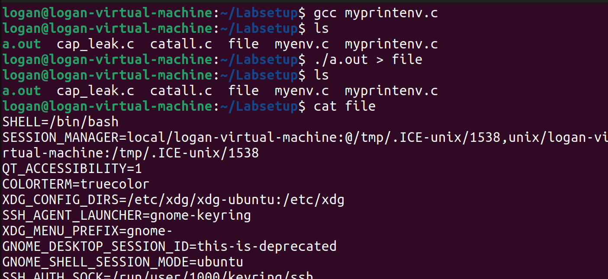

# Environment Variables and Set-UID Seed Lab  
  
1. **Passing Environment Variables from Parent to Child Process**  
	First, the SEED Lab uses the fork() command as a catalyst for studying parent/child relationships in processes. I first compiled the provided program, ``myprintenv.c``, using ``gcc``, which generated a binary called ``a.out``. I then ran that binary and saved it's output to the file "``file``", which can be seen below.  
  
	  Next I opened the program using ``nano`` and commented out the ``printenv()`` statement in the child process line, in turn uncommenting ``printenv()`` in the parent line.

	 After writing the output of the new version of ``myprintenv().c`` to another file, I used the ``diff`` command to see if there were any differences; namely, if the environment variables were present in both files. The lack of output from ``diff`` showed that the environment variables are in fact inherited when using ``fork()`` to create a child process.  

2. **Environment Variables and ``execve()``**  
	Next I explored how environment variables are inherited with ``execve()``. I compiled another program, ``myenv.c``, which prints the environment variables of the current process, and ran it. The lack of output showed that no environment variables were being used.  

	I then opened ``myenv.c`` and changed what was previously a ``NULL`` parameter in the ``execve()`` call to "``environ``".  

	Upon compiling and running, there were now many listed environment variables.  

	This change shows that when using ``execve()``, the new program inherits it's environment variables from the initial process by using the ``environ`` pointer  within the ``execve()`` call.  

3. **Environment Variables and ``system()``**  
	I next wanted to see how environment variables are affected when a new program is executed via ``system()``. To do this, I created a program called ``systemenv.c`` with the following code:  

	Running the program printed the environment variables of the calling process, showing that they are passed from said process to the new program when using ``system()``.  

4. **Environment Variable and ``Set-UID`` Programs**  
	My next step was to see how this was all affected by the idea of Set-UID privileges and programs, so I wrote out the following program to print all the environment variables in the current process.  

	I then made it a Set-UID program, compiling and changing its ownership to root using ``chown`` and ``chmod``.  

	After using the ``export`` command to set the ``PATH``, ``LD_LIBRARY_PATH``, and ``MY_ENV`` environment variables, I ran the Set-UID program to see if they were all inherited by the Set-UID child process. 

	As can be seen by the output below and the fact that I was no longer able to recompile my program due to the changed ``PATH`` variable, all three environment variables I set were inherited by the Set-UID child process.  

5. **The PATH Environment Variable and ``Set-UID`` Programs**
	Now knowing the behavior of the ``PATH`` variable within Set-UID, I wanted to see if this could create a possible point of vulnerability when using ``system()`` within a privileged program. To do this, I created a Set-UID program calling ``system("ls")``.  

	Because this program uses the relative path of ``ls`` (the actual path being ``/bin/ls``), I was able to create my own "``ls``" containing potentially malicious code and change the ``PATH`` environmental variable to redirect the function call to my malicious ``ls`` program instead.  

	An extra step seen below to make sure the attack runs smoothly is linking the ``/bin/dash`` shell program to ``/bin/zsh``, a program that lacks a countermeasure dash has in place to prevent itself from being executed inside of a Set-UID process.  

6. **The ``LD_PRELOAD`` Environment Variable and ``Set-UID`` Programs**  
	Having now explored the ``PATH`` environmental variable, I wanted to experiment with ``LD_PRELOAD`` and dynamic linker/loaders. First, I wanted to see how the environmental variable influences said dynamic loader/linker when running a normal program. To do so, I built a dynamic link library by creating the program ``mylib.c`` to override the ``sleep()`` function in ``libc``.  

	I then compiled the program using the following ``gcc`` commands, and set the ``LD_PRELOAD`` environment variable to the execution of the program I just created.  

	Finally, I created another program ``myprog`` to run and test under several different conditions.  

	Under the condition that it is executed by a normal user, the dynamic loader loaded the created shared library instead, resulting in my override program executing.  

	When changing ``myprog`` to a Set-UID program, the normal "sleep" function was executed instead of my newly created version. This showed that Set-UID ignores the LD_PRELOAD variable.  

	I next changed to the root user using ``sudo su`` and executed the program once again. Seeing that it called the normal sleep function, I exported the ``LD_PRELOAD`` variable once again, and doing that caused my new ``sleep()`` function to run instead. 

	For the final test, I adjusted the Set-UID parameters of ``myprog`` to recognize another normal user, "sally", as the owner. I then ran the program as the original user (logan), and this time the normal "sleep" function was called.  

	These four tests all narrowed down to one conclusion: as a normal user, the ``LD_PRELOAD`` environmental variable successfully injects a shared library into the loading process, overriding the functions in the system's libraries. However, when changed to a Set-UID program, the dynamic loader ignores the set LD_PRELOAD variable. The third test showed that this ignoring of LD_PRELOAD might only be privilege-based, as when ``myprog`` was created as a Set-UID program with the owner as "root", and then run by the root user, the changed LD_PRELOAD variable was used instead of ignored. This showed that there may be a countermeasure in place to ignore environment variables like LD_PRELOAD if the user's real UID is not the same as their effective UID.  

7. **Invoking External Programs Using ``system()`` versus ``execve()``**  
	 The next part of the SEED lab presents a scenario where an outside user (user1) needs to be able to read all the files on another user's system (user2), but not be able to modify them. User2 created a Set-UID program to achieve this, and gave user1 execute permissions, requiring them to type a file name at the command line, and then running ``/bin/cat`` to display the specified file, all while running as the root user (user2). The program can be seen below.  

	To test if this program works as intended, I first compiled it and made it a a root-owned Set-UID program. I then tried removing a non-writable file as a way of testing the system's integrity. The non-writable file (``securefile.txt``) can be seen below being deleted by the normal user by chaining the ``rm`` command into the ``./catall`` program's arguments. Therefore, the integrity of the system is compromised; user1 should only be able to read files, definitely not delete them.  

	To hopefully fix this, I commented out the program's ``system(command)`` statement, and uncommented the ``execve()`` statement. 

	After recompiling and remaking the ``catall`` into a root-owned Set-UID program, I recreated the secure file, and attempted the same attack as before. However, the attack failed, as ``execve()`` did not interpret the ``;`` as chaining a command, but instead as part of the filename--which it could not find, resulting in an error.

8. **Capability Leaking**
	The last thing I tested was the idea of capability leaking, to see if I could exploit remaining privileged capabilities of a Set-UID program after having it's main privilege downgraded. After creating a secure root-owned file called "zzz" with ``sudo touch /etc/zzz`` I compiled the below program as a root-owned Set-UID program, running it as a normal user. 

	Aside from printing the file descriptor value, it left the file descriptor open, meaning that I could then write commands to execute. So I tried writing to the root-owned secure "zzz" file with ``echo``, the ``>&3`` directing the output of ``echo`` back into the file descriptor. I then printed the file to confirm that it had been written to, as can be seen below. 

This fully displayed the capability leaking vulnerability this file has, as a normal user can use the program to write to secure files very easily. 