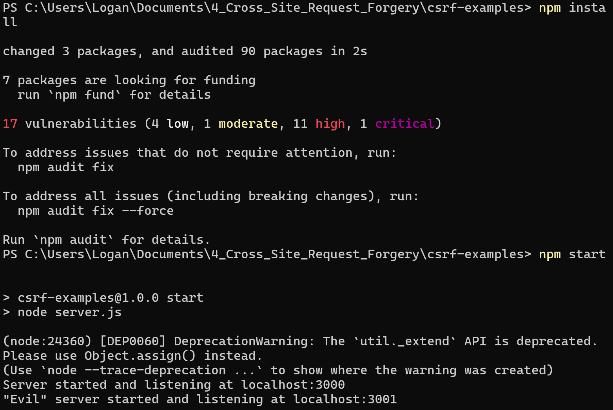
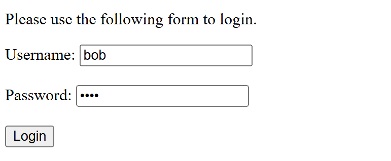
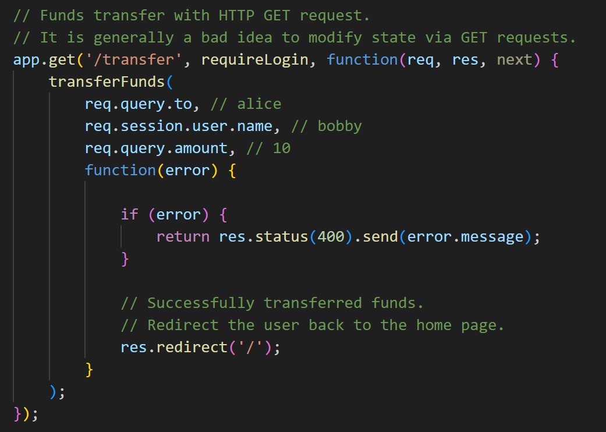
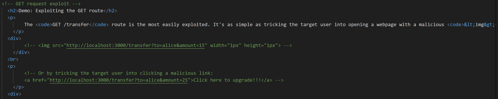
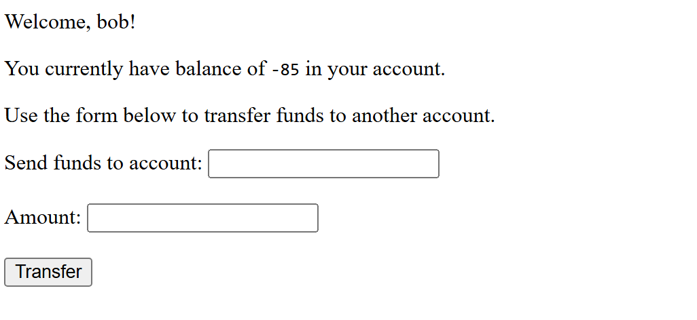

# Cross Site Request Forgery Home Lab  
  
1. **Preparation**  
	Unlike my previous home labs, for this one I did not use my usual ubuntu virtual machine. Instead, I used my actual windows machine, and started by installing Node.js. As for my text editor, I used VS Code. After installing node.js, I opened the terminal and cd'd into the folder containing all the files I was planning to use, and used ``npm install`` to make sure I had all the needed dev dependencies installed, then started the server with ``npm start``.  
  

2. **GET request exploit on target site**  
	I then opened my web browser to http://localhost:3000/ as the target website of the attack, and logged in as user "bob".  
  
  
	I then opened the malicious site targeting said website.  
  
	Upon opening the target site, Bob's current balance is $500. However, upon refreshing the malicious page and then the target page, the balance lowered to $485. The Malicious site, just by being loaded, was able to send a request to the target website to deduct funds as if it were requested by Bob himself since he currently has an active session.  

3. **Finding the Vulnerability**  
	To find the vulnerability, I opened the ``server.js`` file from my base folder inside VS Code and looked for the section about a GET request for transferring money.  
  
	the vulnerability within this code is that at no point does it check for the origin of the request. Therefore, the malicious site can send a GET request to ``/transfer`` whenever Bob has an active session with the target website.  
 
4. **Cleansing the Malicious Site**  
	To prevent this from happening, I opened the ``evil-examples.html`` file and commented out the malicious img tag and link  
  

5. **Conducting a CSRF attack via POST request**  
	Now having witnessed the attack via GET request, I wanted to see if I could execute it via POST request. To do this, I once again edited the ``evil-examples.html`` file and added a script to create a POST request , creating a form sending $500 from Bob's account to user Alice's account that would be hidden and submitted automatically upon loading the malicious site.  
  
	   After reloading the malicious page and the target page, as can be seen below, the attack was a success.  
  

6. **Possible Countermeasure**  
	In order to prevent an CSRF attack like this from occurring, the target site must have security measures in place to check if there is an external site is making the request on behalf of the user, or if it is actually the user themself. One way to do this would be through use of a secret token, embedded in each different users' web pages, that is included whenever a request is submitted from within the actual site. The server would check every time a request is made to see if that user's secret token is included, and if not, it would know the request is coming from an external source and the attack would fail.  

7. **Code & Programs**
	Attached alongside this file is the [csrf-examples.zip] file containing all the finished code used in this lab as well as the written POST request program.